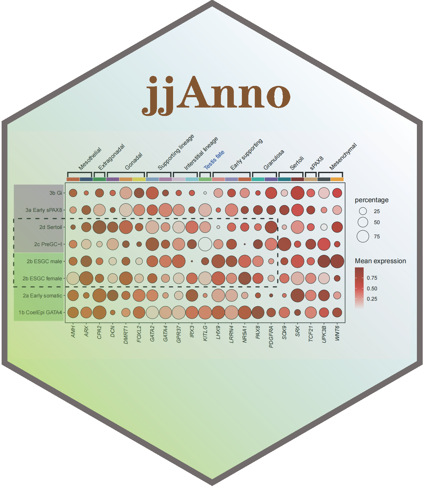

# jjAnno 

<!-- badges: start -->

In fact, adding multiple different annotations (**text, segment, rect, points, images** and so on) beside the plot is needed. But we do not want to spend much time ,energy and code to render our raw figures. The **Ai**`(Artificial Intelligence)` is a good choice for you to produce a complex plot but **without much accuracy**.

Here I provide a package **jjAnno** that you can add different annotaions including **point**, **text**, **rect**, **segemnt**, **image** beside or inside the plot. This will be **save your much time and cost** to make a complex figure.

<!-- badges: end -->

## Installation

You can install the development version of jjAnno like so:

``` r
# install from cran
install.packages("jjAnno")

# install.packages("devtools")
devtools::install_github("junjunlab/jjAnno")
```

## Citation

> Jun Z (2022). *jjAnno: An Annotation Package for GGplot Plot.*  https://github.com/junjunlab/jjAnno, https://junjunlab.github.io/jjAnno-manual/

## Example

An eaxmple shows here:


## Documentation

More examples and details see:

> **https://junjunlab.github.io/jjAnno-manual/**
